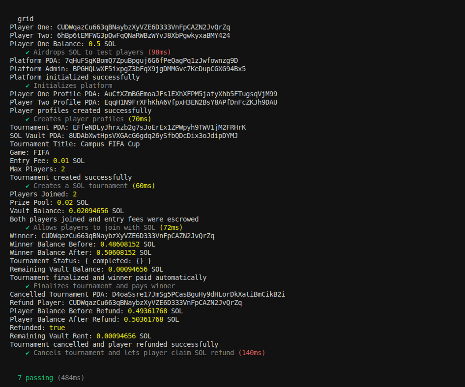

# GRID

### The Trust Layer for Competitive Gaming

GRID is a Solana-powered tournament infrastructure protocol that enables gaming communities, campus organizers, and grassroots esports ecosystems to run transparent competitions with on-chain prize pools, automated payouts, and verifiable tournament records.

Rather than building another game, GRID provides the infrastructure required to organize competitive communities. Tournament entry fees are escrowed on-chain, rewards are distributed automatically, and tournament outcomes become verifiable records that can eventually power player reputation and achievement systems.


# Problem

Across universities, gaming clubs, local esports communities, and online gaming groups, tournaments are typically managed using a combination of:

* Discord servers
* WhatsApp groups
* Google Forms
* Manual payment collection
* Spreadsheet tracking

While these systems work at a small scale, they introduce several trust and operational issues:

* Organizers manually custody prize funds
* Players must trust organizers to distribute rewards fairly
* Payouts are often delayed
* Tournament histories are fragmented across platforms
* There is no portable reputation system for competitive players

As communities grow, these problems become increasingly difficult to manage.


# Solution

GRID moves tournament escrow and reward distribution on-chain using Solana.

Instead of trusting organizers to manually manage prize money, tournament funds are deposited into program-controlled vaults. Players register using their wallets, entry fees are held in escrow, and rewards are distributed automatically when tournament results are finalized.

This creates a transparent system where tournament funds are verifiable, prize distribution is deterministic, and player participation can eventually contribute to an on-chain competitive identity.


# Core Features

### Tournament Creation

Organizers can create tournaments and define:

* Tournament title
* Game category
* Entry fee
* Maximum player count
* Prize distribution structure


### On-Chain Prize Pool

Players deposit SOL into a vault controlled by the GRID program.

Benefits:

* Transparent fund custody
* Verifiable prize pool size
* Reduced organizer trust assumptions


### Player Registration

Players join tournaments directly with their wallet.

Registration information is stored on-chain and linked to the tournament.


### Automated Reward Distribution

Once a tournament concludes, organizers submit the winner list.

The program automatically:

* Calculates payouts
* Transfers rewards
* Marks tournament completion


### Tournament Cancellation & Refunds

If a tournament is cancelled:

* Organizers can cancel the tournament
* Players can claim refunds
* Funds are returned from the escrow vault

This ensures players maintain control over their deposited funds.


# Current MVP Scope

The current MVP focuses on proving the core tournament escrow model.

Implemented:

* Platform initialization
* Player profiles
* Tournament creation
* SOL-based entry fees
* Program-controlled escrow vaults
* Tournament participation
* Tournament finalization
* Automated SOL payouts
* Tournament cancellation
* Player refunds

Planned future features:

* SPL token tournaments
* NFT trophies
* Reputation scoring
* Seasonal leaderboards
* Team tournaments
* Campus leagues
* Sponsor-funded prize pools
* DAO governance
* Tournament discovery frontend


# Program Architecture

The GRID protocol uses Program Derived Accounts (PDAs) to manage state and custody assets.

## Platform State PDA

Stores protocol-wide configuration.

### Fields

* Admin wallet
* Treasury wallet
* Tournament counter
* Platform fee settings
* Pause state


## Tournament PDA

Stores tournament information.

### Fields

* Organizer
* Tournament ID
* Title
* Game
* Entry fee
* Maximum players
* Current players
* Prize pool
* Winners
* Payment type
* Status


## Player Profile PDA

Stores player-related information.

### Fields

* Player wallet
* Wins
* Losses
* Earnings
* Trophy count
* Tournament history


## Player Registration PDA

Represents a player's participation in a tournament.

### Fields

* Tournament
* Player
* Paid amount
* Registration timestamp
* Refund status


## SOL Vault PDA

Stores tournament entry fees.

All player deposits are escrowed within this account until:

* Tournament completion
* Tournament cancellation

---

# Program Instructions

## initialize_platform

Initializes protocol-wide state.

---

## create_player_profile

Creates a player profile PDA.

---

## create_tournament

Creates a new tournament.

---

## join_tournament_sol

Registers a player and deposits the entry fee into escrow.

---

## finalize_tournament_sol

Finalizes tournament results and distributes rewards.

---

## cancel_tournament

Cancels a tournament.

---

## claim_refund_sol

Returns a player's deposited entry fee after cancellation.

---

# Technical Stack

### Blockchain

* Solana

### Smart Contracts

* Rust
* Anchor Framework

### Testing

* TypeScript
* Mocha
* Chai

### Architecture

* PDA-based state management
* Program-controlled vault accounts
* Escrow-based prize pools


# Testing

The test suite validates the complete tournament lifecycle.

### Test Coverage

* Platform initialization
* Player profile creation
* Tournament creation
* Player registration
* SOL deposits
* Vault funding
* Tournament completion
* Automated payouts
* Tournament cancellation
* Refund processing

### Running Tests

```bash
anchor test
```

# Deployment

### Network

Solana Devnet

### Program ID


5FfK29L2jUZGYqwE4sGsyKJdJ4tDE2wrbpzzYdR5EUH


### Verify Deployment

```bash
solana program show 5FfK29L2jUZGYqwE4sGsyKJdJ4tDE2wrbpzzYdR5EUH --url devnet
```


# Future Vision

The current GRID MVP focuses on tournament escrow, participant registration, and automated reward distribution. However, the long-term vision is significantly broader.

GRID aims to become a complete on-chain competitive gaming infrastructure layer where tournaments, reputation, rewards, and match outcomes are verifiable and trust-minimized.

Future development directions include:

### SPL Token Support

Enable tournaments to use stablecoins and other SPL assets for entry fees and prize pools.

### Achievement NFTs & Reputation

Players will earn verifiable achievement NFTs and build portable on-chain reputations that persist across tournaments and communities.

### Team-Based Competitions

Support team tournaments, team rankings, and seasonal leagues.

### Spectator Prediction Markets

Allow community members and spectators to participate in prediction markets around tournament outcomes, creating new forms of engagement around competitive events.

### Sponsor-Funded Prize Pools

Enable brands, gaming communities, and organizations to contribute rewards and incentives directly to tournaments.

### Autonomous Tournament Resolution

Reduce reliance on organizers by integrating directly with supported games and tournament systems.

Instead of organizers manually declaring winners, match results could be verified through trusted game integrations, tournament APIs, oracle networks, or cryptographic proofs.

In this model:

* Games become the source of truth
* Tournament outcomes become verifiable
* Reward distribution becomes fully automated
* Organizer trust assumptions are minimized

### Fully On-Chain Competitive Ecosystems

The long-term objective is to create a platform where competition, achievement, rewards, and reputation are all verifiable and portable across gaming communities.

GRID's ultimate goal is to make competitive gaming as trustless and transparent as financial infrastructure.


# Why GRID

Most tournament platforms focus on the game itself.

GRID focuses on the infrastructure behind competition.

By moving prize custody, payouts, and participation records on-chain, GRID creates a foundation for transparent and verifiable competitive ecosystems.

# Test Results

The GRID test suite validates the complete tournament lifecycle, including:

- Tournament creation
- Player registration
- Prize pool escrow
- Automated payouts
- Tournament cancellation
- Player refunds

## Passing Test Suite

